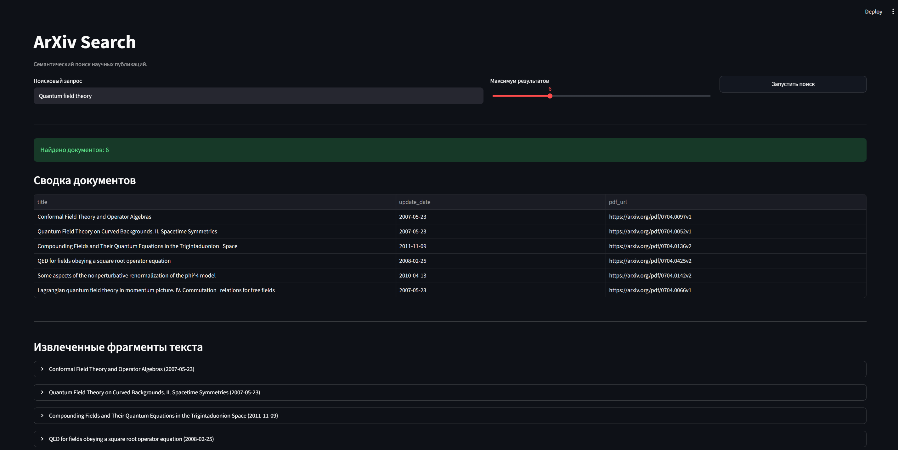

# arxiv-cornucopia

Сервис для работы с научными публикациями из [arXiv](https://arxiv.org/). Проект позволяет загружать и обрабатывать научные статьи, сохранять их представления в векторной базе данных и выполнять семантический поиск по содержимому публикаций.



## Возможности

* преобразование текста статей в векторные представления;
* хранение векторов в [Qdrant](https://qdrant.tech/);
* семантический поиск по содержимому публикаций;

## Требования

Для запуска проекта локально потребуются:

* Python 3.12;
* Docker;
* Docker Compose.

Также для автоматизированного сбора данных с датасета arXiv на Kaggle требуется указать API ключ Kaggle в "~/.kaggle/access_token"

Альтернатива без API ключа: загрузить последнее обновление датасета с https://www.kaggle.com/datasets/Cornell-University/arxiv
в /data/arxiv-metadata-oai-snapshot.json

## 1. Клонирование репозитория

```bash
git clone https://github.com/temich91/arxiv-cornucopia.git
cd arxiv-cornucopia
```

## 2. Запуск приложения

Приложение настраивается и запускается в первый раз следующей командой:

```bash
docker compose up -d --build
```

В последующие разы с помощью команды:

```bash
docker compose up -d
```

### 3. Проверка Qdrant

После запуска Qdrant должен быть доступен на порту, указанном в `docker-compose.yml`.

Для стандартной конфигурации Qdrant HTTP API доступен по адресу:

```text
http://localhost:6333
```

Web-интерфейс Qdrant:

```text
http://localhost:6333/dashboard
```

## Локальный запуск без Docker

Для разработки приложение также можно запускать непосредственно из Python-окружения.

Создайте виртуальное окружение:

```bash
python -m venv .venv
```

Активируйте его.

Linux/macOS:

```bash
source .venv/bin/activate
```

Windows:

```powershell
.venv\Scripts\activate
```

Установите зависимости:

```bash
pip install -r requirements.txt
```

После этого запустите Qdrant отдельно, например через Docker:

```bash
docker compose up -d qdrant
```

Затем запустите Streamlit-приложение:

```bash
python -m streamlit run arxiv-cornucopia\src\app\app_launcher.py
```

## Конфигурация

Конфигурация приложения задаётся через `utils/config.py`.

## Типичный workflow

После запуска инфраструктуры работа с проектом выглядит следующим образом:

```text
1. Запуск Docker Compose
          │
          ▼
2. Запуск приложения
          │
          ▼
3. Получение публикаций arXiv
          │
          ▼
4. Обработка текста
          │
          ▼
5. Построение embeddings
          │
          ▼
6. Сохранение в Qdrant
          │
          ▼
7. Семантический поиск
```

